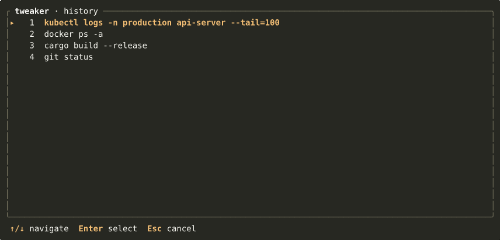

# tweaker

Pick a command from your shell history and tweak it interactively — change a flag, swap an argument, delete or insert a token — then run it. No retyping.



---

## Install

```sh
cargo install --path .
```

Or build locally:

```sh
cargo build --release
# binary at ./target/release/tweaker
```

---

## Standalone usage

Without shell integration, tweaker runs the accepted command directly:

```sh
tweaker
tweaker --limit 50
tweaker --history-file /path/to/custom_history
```

To print the result to stdout instead of executing (what the shell widgets use internally):

```sh
tweaker --print
```

---

## Shell integration

The recommended way to use tweaker is via a shell keybinding. The widget runs tweaker silently, then places the final command into the shell input buffer so the shell records it in history naturally. The `tweaker` invocation itself is never recorded.

### zsh

```zsh
eval "$(tweaker init zsh)"
```

Binds **Ctrl+G**. Add to `~/.zshrc`.

### bash

```bash
eval "$(tweaker init bash)"
```

Binds **Ctrl+G**. Add to `~/.bashrc`.

### PowerShell

```powershell
Add-Content $PROFILE "$(tweaker init powershell)"
```

Binds **Ctrl+G** via `Set-PSReadLineKeyHandler`. Requires PSReadLine (included with PowerShell 5+).

---

## History file detection

tweaker looks for a history file in this order:

1. `--history-file` flag
2. `$HISTFILE` environment variable
3. **Windows**: `%APPDATA%\Microsoft\Windows\PowerShell\PSReadLine\ConsoleHost_history.txt`
4. `~/.zsh_history`
5. `~/.bash_history`
6. `~/.history`

---

## Picker

Press **Ctrl+G** (or run `tweaker`) to open the history picker.

| Key             | Action                       |
| --------------- | ---------------------------- |
| `↑` / `k`       | Move up                      |
| `↓` / `j`       | Move down                    |
| `PgUp` / `PgDn` | Jump 10 entries              |
| `Home` / `End`  | First / last entry           |
| `Enter`         | Select and open tweak screen |
| `Esc` / `q`     | Cancel                       |

---

## Tweak screen

After picking a command, each token gets a yellow hint label on the row below it (easymotion-style). Press a label to act on that token.

```
git commit --amend -m "fix: typo in readme"
1   2      3       4  5
```

Labels run `1–9` then `A–Z` (uppercase, so lowercase letters are free as command prefixes).

### Normal mode keys

| Key              | Action                                      |
| ---------------- | ------------------------------------------- |
| `1`–`9`, `A`–`Z` | Edit that token in place                    |
| `d` then hint    | Delete that token                           |
| `a` then hint    | Insert a new token **after** that position  |
| `i` then hint    | Insert a new token **before** that position |
| `u`              | Undo last change                            |
| `Ctrl+R`         | Redo                                        |
| `Ctrl+S`         | Toggle suggestions panel (if available)     |
| `Tab`            | Focus suggestions panel (when visible)      |
| `Enter`          | Accept and run (or print, in widget mode)   |
| `Esc`            | Cancel — exit without running               |

### Editing a token

The token underlines and a real cursor appears at its position. Surrounding tokens shift as you type.

| Key                 | Action                      |
| ------------------- | --------------------------- |
| Type                | Insert character at cursor  |
| `←` / `→`           | Move cursor                 |
| `Home` / `End`      | Jump to start / end         |
| `Backspace` / `Del` | Delete character            |
| `Ctrl+U`            | Clear the token             |
| `Ctrl+S`            | Cycle quote style (none → `'` → `"`) |
| `Enter`             | Commit edit                 |
| `Esc`               | Cancel edit — token reverts |

### Suggestions panel

When a tldr page exists for the current command (requires [tealdeer](https://github.com/tealdeer-rs/tealdeer) to be installed and its cache populated), or a man page is available, a suggestions panel appears alongside the tweak box.

Press `Ctrl+S` to show/hide the panel, then `Tab` to focus it:

| Key         | Action                                           |
| ----------- | ------------------------------------------------ |
| `↑` / `k`   | Move selection up                                |
| `↓` / `j`   | Move selection down                              |
| `Enter`     | Apply — replace all tokens (tldr) or append flag (man page) |
| `Tab` / `Esc` | Return to normal mode without applying         |

Applied suggestions are undoable with `u`.

### Undo / redo

Undo granularity is one completed mutation per step: a full edit commit, a delete, or an insert. Keystrokes inside the edit buffer are not individual undo steps. Redo stack is cleared when a new mutation is made.

---

## CLI reference

```
Usage: tweaker [OPTIONS] [COMMAND]

Commands:
  init  Print shell integration snippet

Options:
      --limit <LIMIT>                Max history entries to load [default: 200]
      --history-file <HISTORY_FILE>  Path to a history file
      --print                        Print tweaked command to stdout instead of running it
  -h, --help                         Print help

tweaker init <SHELL>
  Shells: zsh, bash, powershell
```

---

## Platform support

| Platform           | Terminal                   | History         |
| ------------------ | -------------------------- | --------------- |
| Linux              | Full (crossterm + ratatui) | zsh / bash      |
| macOS              | Full                       | zsh / bash      |
| Windows (Terminal) | Full                       | PSReadLine      |
| Windows (Git Bash) | Full                       | `.bash_history` |
| WSL                | Full                       | zsh / bash      |
